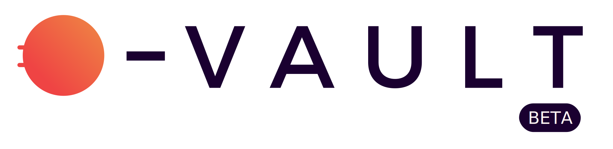
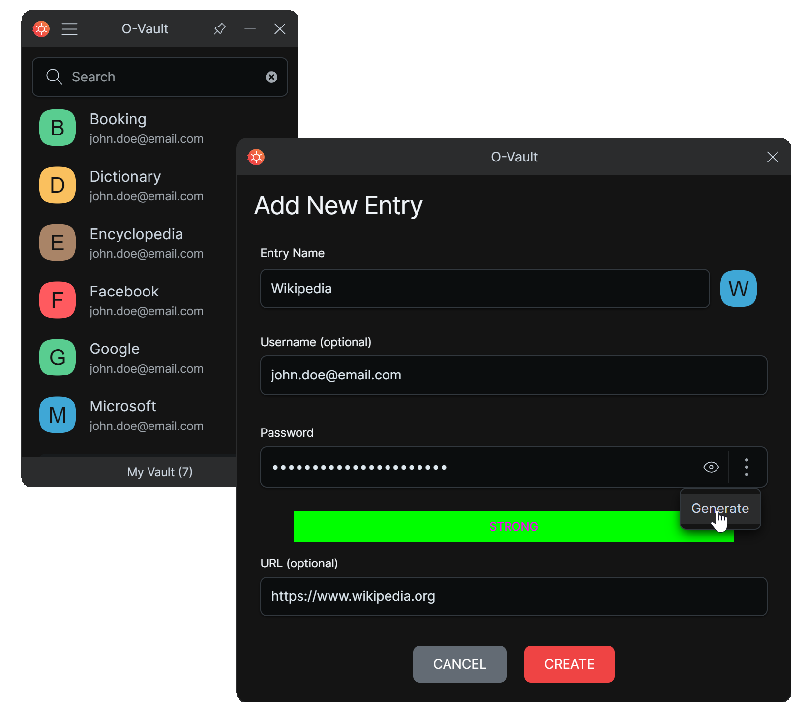

# O-Vault Password Manager

## Description

<picture>
  <source media="(prefers-color-scheme: dark)" srcset="./web/public/o-vault-logo-dark.svg">
  
</picture>

O-Vault is a secure Password Manager. It is free and open source. 

O-Vault is a desktop application for:

- Windows
- MacOS
- Linux

O-Vault is fully offline, your passwords are saved locally on your device in an encrypted file called the vault.

With O-Vault you only need to remember one password to open your vault. All your other passwords are saved in your vault.

O-Vault uses the Chromium encryption API  [SubtleCrypto](https://developer.mozilla.org/en-US/docs/Web/API/SubtleCrypto/encrypt#aes-gcm) using a strong and standard encryption algorithm (AES-GCM). If you are interested to review how the vault is encrypted, this happens [here](https://github.com/O-Vault/O-Vault/blob/main/lib/src/encryption.ts) in the encrypt function. 

Your vault is a standalone file, you can make a backup of it on a usb key, to an external harddrive or to your cloud document provider (Google Drive, One Drive, etc).

## Screenshots

## Download

Here is the link to download the latest stable version: [Download Page](https://github.com/O-Vault/O-Vault/releases/latest)

## Feedbacks

- To log an issue or enhancement ticket, follow this [link](https://github.com/O-Vault/O-Vault/issues)
- Or you can share your thoughs in the [Discussions page](https://github.com/O-Vault/O-Vault/discussions)

## Source code

The source code is on [github](https://github.com/O-Vault/O-Vault/).

## Author

Nicolas Puzin aka [end3rbyte](https://github.com/end3rbyte).

## License

[MIT](https://github.com/O-Vault/O-Vault/blob/main/LICENSE)

